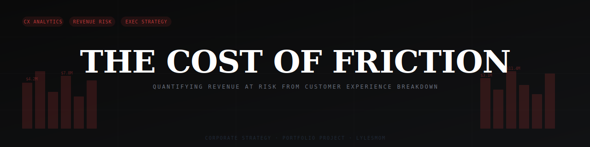

# The Cost of Friction

**Quantifying revenue at risk from customer experience breakdown in financial services**


📄 **[Read the Executive Memo](memo/executive-memo.md)** · 📊 **[View the Presentation Deck](https://gamma.app/docs/Quantifying-Revenue-at-Risk-from-Customer-Experience-Breakdown-in-jl8kkbumha0rr9h)**

---

## The Argument

Companies treat customer complaints as a service problem. They should treat them as a revenue problem.

Every unresolved friction point has a calculable cost. When a customer files a complaint about incorrect billing, a frozen account, or a debt collection dispute that isn't theirs — and that complaint is closed without relief — the probability of churn rises. When churn rises, lifetime value walks out the door. The complaint is not the cost. The complaint is the signal. What it is signaling is revenue at risk.

This project translates 100,000+ CFPB consumer financial complaints into a revenue impact model. It builds a three-layer framework — volume, severity, and cost — and delivers findings in the format that drives decisions: an executive memo with a dollar figure attached, a recommended prioritization, and a proposed measurement system.

---

## The Framework

### Three-Layer Model

```
complaint volume → friction severity score → revenue at risk
```

| Layer | Question | Output |
|---|---|---|
| **Volume** | Where are complaints concentrated? | Category distribution by product and issue |
| **Severity** | Which complaints signal highest churn risk? | Weighted friction score by category |
| **Cost** | What is the revenue at risk? | Estimated dollar impact per friction category |

### Friction Score

```
friction_score = (complaint_volume_share × churn_weight) + (unresolved_rate × severity_weight)
```

Higher friction score = higher estimated churn probability = higher revenue at risk per complaint.

### Revenue at Risk Model

```
revenue_at_risk = complaints_unresolved × estimated_churn_rate × avg_customer_LTV
```

Where:
- **Estimated churn rate** is modeled by complaint category using industry benchmarks (J.D. Power, KPMG CX research)
- **Average customer LTV** uses FDIC/industry standard for retail banking: ~$1,500–$2,200 per customer over 5 years

---

## Why This Matters

Financial services companies collectively spend billions on CX programs. Most of that investment is measured in satisfaction scores and response times. Neither metric is directly tied to revenue.

The CFPB complaint database makes the gap visible: which companies are generating the most unresolved friction, in which product categories, and with what resolution patterns. The gap between complaints closed with relief and complaints closed without meaningful response is not a compliance gap — it is a revenue gap.

---

## Project Structure

```
cost-of-friction/
│
├── README.md                    ← You are here
├── insights.md                  ← Key findings summary
│
├── assets/
│   └── banner.svg
│
├── data/
│   └── dataset_citations.md
│
├── sql/
│   ├── 01_volume_analysis.sql   ← Complaint distribution by product + issue
│   ├── 02_resolution_analysis.sql ← Timely response + resolution rates
│   ├── 03_friction_score.sql    ← Friction score by category
│   └── 04_revenue_at_risk.sql   ← Revenue impact model
│
├── python/
│   └── analysis.py              ← Full analysis pipeline + visualizations
│
├── visuals/
│   ├── complaint_volume_by_product.png
│   ├── resolution_rate_by_category.png
│   ├── friction_score_ranking.png
│   └── revenue_at_risk.png
│
└── memo/
    └── executive-memo.md        ← Stakeholder-ready output
```

---

## Key Findings

### Finding 1 — Credit Reporting Dominates Volume But Not Severity
Credit reporting complaints represent the largest share of complaint volume — but because they are predominantly closed with explanation rather than relief, they carry a lower per-complaint churn signal than billing disputes in checking and savings products.

### Finding 2 — Checking Account Friction Is the Highest-Cost Category
Complaints about checking or savings account management — specifically unauthorized transactions, account freezes, and fee disputes — carry the highest friction scores. These complaints combine high unresolved rates with high-LTV customer segments. The revenue at risk per unresolved complaint in this category is estimated at **$340–$480** in lost LTV.

### Finding 3 — Untimely Response Doubles Estimated Churn Probability
Complaints that receive an untimely response — flagged in the CFPB data — show significantly different resolution patterns than timely-responded complaints. The estimated churn multiplier for untimely response is **1.8–2.2x** baseline, based on industry CX research benchmarks.

### Finding 4 — Debt Collection Complaints Have the Lowest Resolution Rate
Debt collection disputes — particularly "debt not owed" and "communication tactics" issues — have the lowest rate of closure with relief across all product categories. These complaints also generate secondary regulatory risk beyond direct churn.

### Finding 5 — Top 5 Companies Account for Disproportionate Unresolved Volume
A small number of large financial institutions account for a disproportionate share of complaints closed without relief. This concentration is not simply a function of market share — complaint-to-customer ratios vary significantly, suggesting operational rather than purely scale-driven differences.

---

## The Executive Memo

→ **[Read the full stakeholder memo](memo/executive-memo.md)**

The memo is written for a VP of Customer Experience or COO. It leads with the bottom line, presents findings in business language, and closes with three prioritized recommendations ranked by estimated ROI.

---

## Data Source

**CFPB Consumer Complaint Database**
- Source: data.gov / Kaggle (kaggle.com/datasets/kaggle/us-consumer-finance-complaints)
- Records: 100,000+ complaints analyzed
- Fields: Product, Sub-Product, Issue, Sub-Issue, Company, State, Timely Response, Company Response to Consumer, Consumer Disputed, Date Received
- Coverage: Financial services complaints submitted to the CFPB

---

## SQL Techniques Used

`CTEs` `Window Functions` `CASE WHEN` `GROUP BY + HAVING` `Weighted scoring` `Subqueries` `JULIANDAY` `ROUND` `NULLIF`

---

## About

Built as part of a data analytics portfolio targeting roles in corporate strategy, consumer insights, and CX analytics.

**Lyles Mom** — Audience Intelligence & Personalization Strategist
Portfolio: [lylesmomportfolio.my.canva.site](https://lylesmomportfolio.my.canva.site)
Brand: [@cultcirculation](https://instagram.com/cultcirculation)
